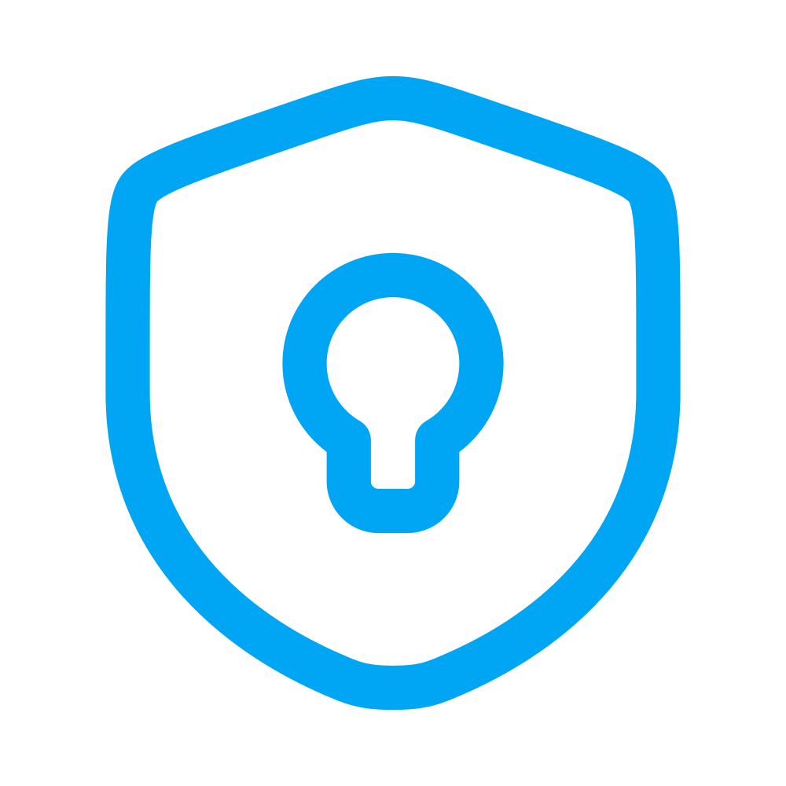

<p align="center">
    
    <p align="center">
        <a href="https://github.com/fadez/sneakpeek/actions/workflows/ci.yml"></a>
        <a href="https://github.com/fadez/sneakpeek/actions/workflows/cd.yml"></a>
    </p>
</p>

------

> Secure, one-time secret sharing made simple.

Built by **[@fadez](https://github.com/fadez)** in **[Cursor](https://cursor.com)** using **[Laravel](https://laravel.com)**, **[Vue.js](https://vuejs.org)** and **[Tailwind CSS](https://tailwindcss.com)**.

**SneakPeek** showcases my full-stack development skills and workflow, combining modern frameworks and best practices to deliver a secure, scalable, and production-quality web application.

# Live demo

**[sneakpeek.alexfadez.com](https://sneakpeek.alexfadez.com)**

# Features

### Backend

- **Laravel framework**
    - RESTful API using Laravel API Resources with clean controllers and rate-limited routes
    - Eloquent ORM with custom scopes, accessors, and API Resources
    - Database migrations with proper indexing for performance and integrity
    - A scheduled command to permanently wipe expired secrets from the database
- **Security-first design**
    - End-to-end privacy — no authentication, no logs
    - Secrets can only be accessed once, then wiped permanently
    - Encrypted content storage using Laravel's built-in encryption
    - Optional hashed passphrase protection for secrets
    - Optional expiration time for secrets
- **Clean architecture**
    - Readable, maintainable code with scoped responsibilities
    - **[SOLID](https://en.wikipedia.org/wiki/SOLID)** principles applied throughout
- **Quality Assurance (QA)**
    - A comprehensive suite of unit, feature, and browser tests using **[Pest](https://pestphp.com)**
    - Strict code consistency and PSR-12 compliance, enforced by **[Laravel Pint](https://laravel.com/docs/pint)**
    - Strict static analysis with maximum type safety — 100% coverage with **[PHPStan](https://phpstan.org)** level 10, enforced by **[Larastan](https://github.com/larastan/larastan)**

### Frontend

- **Vue.js**
    - Composition API
    - Vue Router
    - Component-based architecture
    - Reactive state management
- **Tailwind CSS**
    - Responsive and beautiful UI
    - Auto-switching light/dark mode support
- **Vite**
    - Fast builds, hot module replacement, production optimization

### CI/CD

- **Continuous Integration (CI)**
    - **[Automated CI tests](.github/workflows/ci.yml)** using **[Laravel Pint](https://laravel.com/docs/pint)**, **[PHPStan](https://phpstan.org)**, **[Pest](https://pestphp.com)** and **[Playwright](https://playwright.dev)** via GitHub Actions on every push
- **Continuous Deployment (CD)**
    - **[Automated CD pipeline](.github/workflows/cd.yml)** that deploys to a **[Google Cloud](https://cloud.google.com)** Compute Engine instance via SSH
    - Secure SSH orchestration via encrypted GitHub Secrets and SSH key-pairing for automated remote deployment

### Deployment & DX

- **Deployment**
    - Zero-friction deployment with included deployment script and **[nginx](https://nginx.org)** configuration template
- **Developer Experience (DX)**
    - Automated onboarding via a single command that handles environment setup, SQLite database creation, and dependency installation
    - **[Laravel Boost](https://laravel.com/ai/boost)** integration for **[Cursor](https://cursor.com)** via **[MCP (Model Context Protocol)](https://modelcontextprotocol.io)** server accelerates AI-assisted development by providing the essential context and structure that AI needs

# Installation

### Prerequisites

Before beginning installation, make sure that your local machine has:
- **[PHP](https://php.net)** v8.3+
- **[Node.js and npm](https://nodejs.org)** v18+
- **[Composer](https://getcomposer.org)**
- **[Git](https://git-scm.com)**

I highly recommend using **[Laravel Herd](https://herd.laravel.com)** as your local development environment.

### Setting up the project

Go to your **[Laravel Herd](https://herd.laravel.com)** or **[Laravel Valet](https://laravel.com/docs/valet)** sites folder and run:

```sh
git clone https://github.com/fadez/sneakpeek.git && cd sneakpeek && composer setup
```

### Visiting the site

If you're using **[Laravel Herd](https://herd.laravel.com)** or **[Laravel Valet](https://laravel.com/docs/valet)**, you can now access the app at **[sneakpeek.test](http://sneakpeek.test)**.
