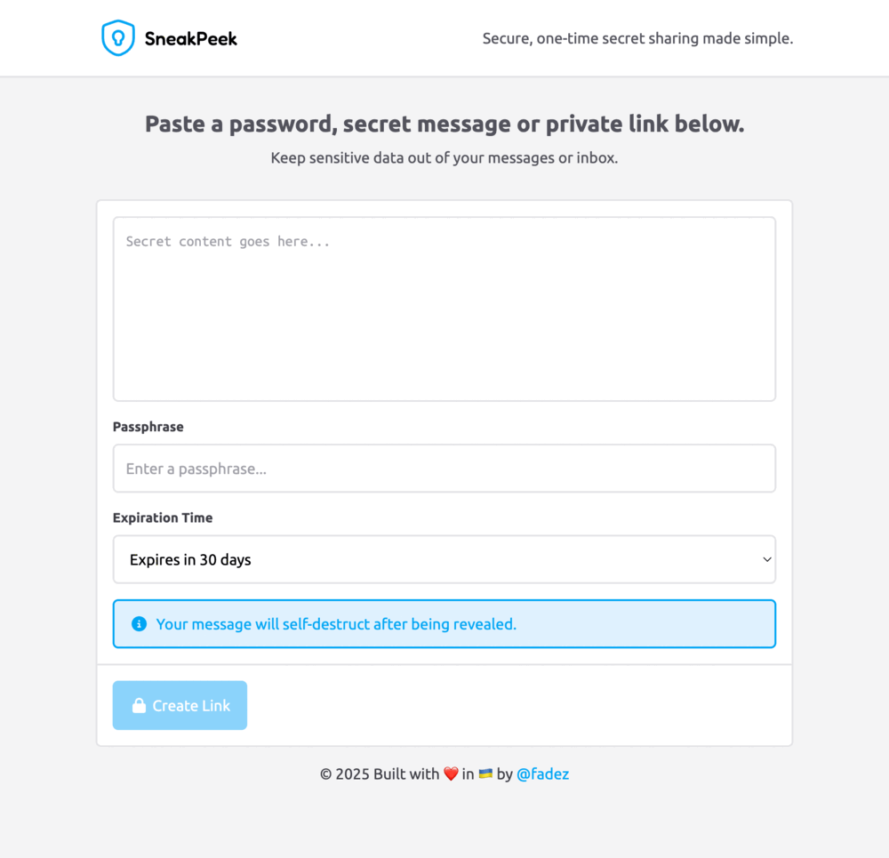

<div align="center">
    
</div>

# About SneakPeek

> Secure, one-time secret sharing made simple.

Built by **[@fadez](https://github.com/fadez)** in **[Cursor](https://cursor.com)** using **[Laravel](https://laravel.com)**, **[Vue.js](https://vuejs.org)** and **[Tailwind CSS](https://tailwindcss.com)**.

SneakPeek is a demonstration of my full-stack development skills, combining modern frameworks and best practices to deliver a secure, scalable, and modern web application.

# Live Demo

**[sneakpeek.alexfadez.com](https://sneakpeek.alexfadez.com)**

# Features

### Backend
- **Laravel framework**
    - RESTful API with clean controllers and rate-limited routes
    - Eloquent ORM with custom scopes, accessors, and API Resources
    - Database migrations with proper indexing for performance and integrity
    - Scheduled command to auto-delete expired secrets
- **Security-first design**
    - End-to-end privacy — no authentication, no logs
    - Secrets can only be accessed once, then wiped permanently
    - Encrypted content storage using Laravel's built-in encryption
    - Optional hashed passphrase protection for secrets
    - Optional expiration time for secrets
- **Clean architecture**
    - Readable, maintainable code with scoped responsibilities
    - SOLID principles applied throughout

### Frontend
- **Vue.js**
    - Composition API
    - Vue Router
    - Component-based architecture
    - Reactive state management
- **Tailwind CSS**
    - Responsive and beautiful UI
    - Auto-switching light/dark mode support
- **Vite**
    - Fast builds, hot module replacement, production optimization

# How to install

### Prerequisites
You need to have PHP, Node.js and Composer installed globally on your system.

I recommend using **[Laravel Herd](https://herd.laravel.com)** as your development environment.

### Cloning the repository

Go to your **[Laravel Valet](https://laravel.com/docs/master/valet)** or **[Laravel Herd](https://herd.laravel.com)** sites folder and clone the repository via:

```sh
git clone https://github.com/fadez/sneakpeek.git
```

Then run the included installation script:

```sh
sh install.sh
```

### Securing site with TLS

Then you need to secure the site with TLS.

If you're using **[Laravel Valet](https://laravel.com/docs/master/valet)** you can do this via:

```sh
valet secure sneakpeek
```

If you're using **[Laravel Herd](https://herd.laravel.com)** you can do this via:

```sh
herd secure sneakpeek
```

### Visiting the site

You can access the app at **[sneakpeek.test](https://sneakpeek.test)**.

# UI Preview

<div align="center">
    
</div>
