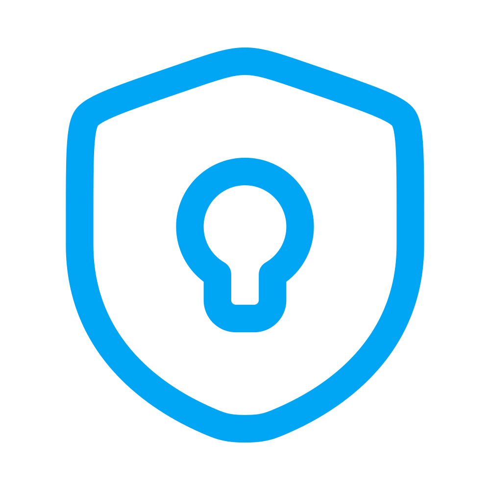

<p align="center"></p>

# About SneakPeek

> Secure, one-time secret sharing made simple.

Built by **[@fadez](https://github.com/fadez)** in **[Cursor](https://cursor.com)** using **[Laravel](https://laravel.com)**, **[Vue.js](https://vuejs.org)** and **[Tailwind](https://tailwindcss.com)**.

SneakPeek is a demonstration of my full-stack development skills, combining modern frameworks and best practices to deliver a secure, scalable, and modern web application.

# Features

### Backend
- **Laravel framework**
    - RESTful API with clean controllers and rate-limited routes
    - Eloquent ORM with custom scopes, accessors, and API Resources
    - Database migrations with proper indexing for performance and integrity
    - Scheduled command to auto-delete expired secrets
- **Security-first design**
    - End-to-end privacy — no authentication, no logs
    - Secrets can only be accessed once, then wiped permanently
    - Encrypted content storage using Laravel's built-in encryption
    - Optional hashed passphrase protection for secrets
    - Optional expiration time for secrets
- **Clean architecture**
    - Readable, maintainable code with scoped responsibilities
    - SOLID principles applied throughout

### Frontend
- **Vue.js**
    - Composition API
    - Vue Router
    - Component-based architecture
    - Reactive state management
- **TailwindCSS**
    - Responsive and beautiful UI
    - Auto-switching light/dark mode support
- **Vite**
    - Fast builds, hot module replacement, production optimization

# How to install

Clone the repo and simply run the included install script:

```bash
sh install.sh
```

If you're using **[Laravel Valet](https://laravel.com/docs/master/valet)**, access the app at **[sneakpeek.test](http://sneakpeek.test)**.